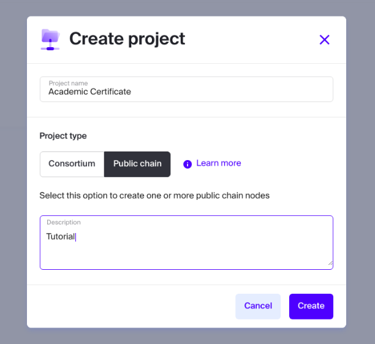
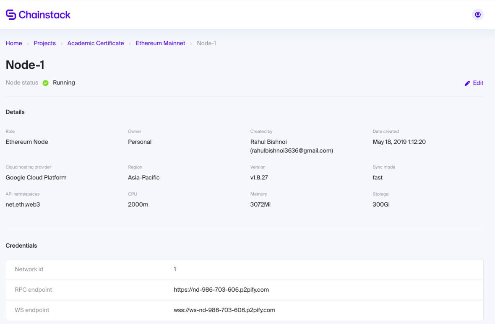

# Academic Certificates on Ethereum using Chainstack
Chainstack is multi-cloud, multi-protocol Platform-as-a-Service. It automates DevOps process for public and consortium blockchain development. You can configure and deploy Ethereum, Quorum or MultiChain node using any cloud provider of your choice just with a few clicks.
You can try chainstack for free [here](https://console.chainstack.com/).

In this tutorial we'll be writing a certificate generating dapp and will deploy it on public ethereum node using chainstack.

Let's begin!!!

## Prerequisites
- Git
- Truffle
- Chainstack account

## Deploying a node
To begin you'll need a chainstack account (free or on any paid plan), to know how to get a free chainstack account follow these [steps](https://docs.chainstack.com/guides/getting-started)

So after creating an account move to "https://console.chainstack.com/" and there you'll see "Create project", click on it to create a new project, fill out your project details similar to this

<p align = "center">

</p>

You can see created projects on your dashboard.
- Choose your project and click on "Get started" to connect it to a public ethereum mainnet network.
- In next step choose "Node type", based on your requirement you can decide whether you want a shared node(shared with other users) or a dedicated one(to you only). Also choose any cloud hosting provider.
- Join Network

Great!! so now you have deployed a node on ethereum mainnet, click on it to see node details. It should look similar to this.

<p align = "center">

</p>

You can see a RPC endpoint, we'll need that later to connect to our node.

## Creating and Compiling dapp
First you need a boilerplate dapp, go to any empty directory and run `truffle init` to setup a project in that directory.
Some files will generate and your directory should look like this
```
.
├── contracts
│   └── Migrations.sol
├── migrations
│   └── 1_initial_migration.js
├── test
└── truffle-config.js
```

Go to contracts and create two files
1. `Ownable.sol`
```
pragma solidity ^0.5.0;

contract Ownable {
  address public owner;
  event OwnershipTransferred(address indexed previousOwner, address indexed newOwner);

  constructor() public {
    owner = msg.sender;
  }

  modifier onlyOwner() {
    require(msg.sender == owner);
    _;
  }

  function transferOwnership(address newOwner) onlyOwner public {
    require(newOwner != address(0));
    emit OwnershipTransferred(owner, newOwner);
    owner = newOwner;
  }
}
```
This is just a ownable contract and will be used so that only authority can  "Generate certificate", also you can see only an owner can transfer his authority to anyone else.

2. `DocStamp.sol`
```

```
This is our main contract and it will handle genrating and verification of certificates, as you can see it inherits from Ownable so we'll only have to deploy it to include both contracts properties.

- `issueCertificate` function generates certificate by taking the hash of name and details of student, it can be called by only owner. It emits the event of certificate generation along with timestamp.
Issuer put the certificate on blockchain by storing it into global variable `records` by passing `records[certificate] = msg.sender`, 
- `owningAuthority` returns the address of issuer/authority.
- `verifyCertificate` takes name and details of the student and calculate the hash of them and then check if it exists on blockchain or not. It can be called by anyone.

After writing our contracts just add `deploy_contracts.js` in migration folder with this data
```
var DocStamp = artifacts.require("./DocStamp.sol");

module.exports = function(deployer) {
  deployer.deploy(DocStamp);
};
```
It deploys the contract.

Now let's compile our dapp/contracts, run `truffle compile` and you will see a new directory `build/contracts` containing all our contracts in `json` format(so that simple js can be used to interact with them).

Your contracts are successfully compiled now so let's deploy them to your ethereum node.

## Deploying dapp
First run `npm i truffle-hdwallet-provider` to install hdwallet-provider which will help you connecting to your node.

Open `truffle-config.js` and replace everything with 
```
const HDWalletProvider = require('truffle-hdwallet-provider');
const mnemonic = 'misery walnut expose fluid loyal throw combine icon seed imitate item service turn parent elder';

module.exports = {
 networks: {
    mainnet: {
        provider: () => new HDWalletProvider(mnemonic, {your rpc endpoint url}),
        network_id: 1,
        gas: 4500000,
        gasPrice: 10000000000
    }
   }
};
```
This will cause truffle to deploy contracts over mainnet whose provider is your chainstack node.

run `truffle migrate --network mainnet` to successfully deploy contracts to chainstack node.

### Interacting with contracts

